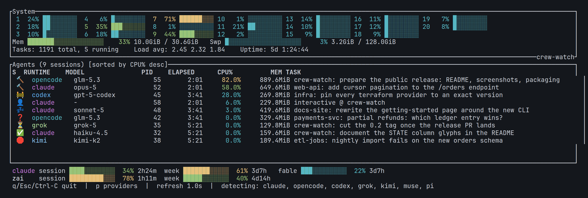
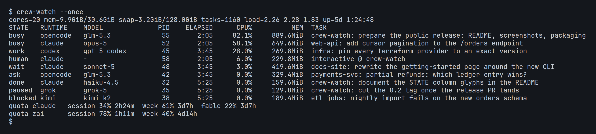

# crew-watch

A terminal monitor for a machine that is running AI coding agents, built as a
companion to **[firstmate](https://github.com/kunchenguid/firstmate)**. The top
half is an htop-style system overview — per-core bars, memory, swap, load,
uptime. The bottom half is the part htop cannot give you: **one row per running
agent session**, with CPU and memory aggregated over that agent's entire process
subtree (an agent's real cost is mostly the compilers, test runners and tools it
spawns), plus the model it is running, how long it has been up, and a one-line
description of what it is working on. If your provider quotas are readable
locally, a compact usage row sits at the bottom.



**crew-watch is built for [firstmate](https://github.com/kunchenguid/firstmate)
fleets.** Point it at a firstmate home and every row picks up the task that
agent is working on and a live activity glyph — busy, waiting, blocked,
needs-decision, done — read straight from firstmate's own task state. That is
the `TASK` and `STATE` half of the table, and it is what the tool is for. It
reads upstream firstmate's file formats directly; no fork, plugin or
configuration is required.

Without a firstmate home it still runs and still earns its place — process
detection, subtree CPU/memory, model and elapsed all work on any box running
`claude`, `opencode`, `codex` or friends — but the `TASK` column falls back to
the project directory and `STATE` stays on the interactive/unknown glyphs.

Linux and macOS.

## Install

`crew-watch` is published on crates.io, so the easiest install is:

```sh
cargo install crew-watch
```

Every install path compiles locally, so you need a recent stable
[Rust toolchain](https://rustup.rs) and — as for any native Rust binary on a
glibc target — a working C link chain (`build-essential` on Debian/Ubuntu,
`gcc` on Fedora; both distros ship it in the usual developer meta-packages).

You can also install straight from the repository:

```sh
cargo install --git https://github.com/ppetermann/crew-watch
```

Or from a clone:

```sh
git clone https://github.com/ppetermann/crew-watch
cd crew-watch
cargo install --path .
```

Whichever route you take, the `crew-watch` binary lands in `~/.cargo/bin`, which
rustup already puts on your `PATH`. If you would rather not install it,
`cargo build --release` leaves the binary at `target/release/crew-watch`.

### Optional: the quota row

The provider-quota row at the bottom of the TUI is the one feature with an
external dependency. crew-watch does not talk to any provider itself — it shells
out to [`quota-axi`](https://www.npmjs.com/package/quota-axi), which reads your
local provider credentials and reports the usage windows:

```sh
npm i -g quota-axi
```

Without it, crew-watch works normally and **the quota row is simply absent** —
the layout is identical to a build without the feature, and no error is shown.
(The one exception: if you have explicitly picked providers with the `p` dialog,
a failing fetch shows a single dim `quota: unavailable (quota-axi not found)`
line instead of hiding, so an explicit choice never fails silently.) Use
`--no-quota` to disable the row and the background fetch outright.

## Usage

```sh
crew-watch                       # interactive TUI, refresh every 2s
crew-watch --interval 1          # refresh every 1s
crew-watch --once                # one-shot text dump, no TTY needed
crew-watch --fm-home ~/agents/firstmate
crew-watch --no-quota            # hide the quota row, skip the quota fetch
crew-watch --quota-interval 120  # refresh quota every 120s (clamped 60..=3600)
```

| Flag | Meaning |
|------|---------|
| `--interval <secs>` | Refresh interval. Default `2`. |
| `--once` | Non-interactive one-shot dump to stdout (see below). |
| `--fm-home <dir>` | firstmate home to read task state from. Also settable via `CREW_WATCH_FM_HOME`; defaults to `~/agents/firstmate`. |
| `--no-quota` | Disable the quota row and its background fetch entirely. |
| `--quota-interval <secs>` | Seconds between quota refreshes. Default `600`, clamped to `60..=3600`. |
| `--help` / `--version` | The usual. |

Key bindings inside the TUI:

| Key | Action |
|-----|--------|
| `q` / `Esc` / `Ctrl-C` | quit |
| `p` | choose which quota providers get a row (when the quota row is enabled) |
| `a` | about screen (version, license, project link); `a` / `q` / `Esc` closes |

Keybindings are deliberately minimal.

### `--once`

Collects two samples about a second apart (so the CPU percentages are real
deltas, not zeroes), prints the system summary and the agent table to stdout,
and exits. Use it to check detection outside a terminal, or to script a fleet
check:



The `--once` table is plain text with no emoji and no bars, so it stays easy to
grep and to diff.

## What the columns mean

**Top — system overview:** per-core usage bars for every core `/proc/stat`
reports, memory and swap bars with used/total figures, task count, load average
(1/5/15) and uptime.

**Bottom — one row per agent session:**

| Column | Meaning |
|--------|---------|
| `S` / `STATE` | What the agent is doing right now — an emoji in the TUI (the header is a bare `S` so the column costs two cells), a word in `--once`. See the table below. |
| `RUNTIME` | Which agent runtime it is: `claude`, `opencode`, `codex`, … |
| `MODEL` | The model it was started with, read from its `--model` argument with the provider prefix stripped for compactness (`zai-coding-plan/glm-5.3` → `glm-5.3`). `-` when there is no model flag, e.g. an interactive session. |
| `PID` | The session's root agent process. |
| `ELAPSED` | How long that process has been running. |
| `CPU%` | Aggregated over the agent's whole process subtree, normalized so one core = 100%. A multi-core subtree can exceed 100%, exactly as in htop. |
| `MEM` | Resident memory, likewise aggregated over the subtree. |
| `TASK` | A one-line description of what the agent is working on (see [Task descriptions](#task-descriptions)). |

Rows are sorted by aggregated CPU% descending. Numeric columns are right-aligned
so magnitudes stack; text columns are left-aligned. When no agent runtime is
running, the panel shows a hint instead of going blank.

On a narrow terminal nothing wraps or overflows: the fixed columns shrink and
values shorten by unit and precision first (`848.6MiB` → `849MiB` → `849M`,
`38:23:40` → `38:23` → `38h`), never by losing their leading digits, so a
magnitude is never misread.

### The STATE column

`STATE` is only meaningful for agents matched to a firstmate task; everything
else falls back to the interactive or unknown glyph.

| State | TUI | `--once` | Meaning |
|-------|-----|----------|---------|
| busy (mid-turn) | 🔨 | `busy` | working, and in a turn right now |
| waiting (between turns) | 💤 | `wait` | working, settled between turns |
| working, turn unknown | 🚧 | `work` | working, but the runtime publishes no turn signal |
| needs decision | ❓ | `ask` | asked a question a human must answer |
| blocked | 🛑 | `blocked` | reported itself stuck |
| paused | ⏳ | `paused` | deliberately idling on a known external wait |
| done (process lingering) | ✅ | `done` | reported done, process still alive |
| failed | ❌ | `failed` | reported failed |
| interactive | 👤 | `human` | a session a human is driving, not a task |
| unknown (default) | 🤖 | `-` | everything else, including autonomous agents with no task record |

On a terminal too narrow for a two-cell column the emoji fall back to single
ASCII characters (`*`, `z`, `w`, `?`, `!`, `~`, `+`, `x`, `@`, `.`). The
authoritative glyph, ASCII and word tables live in
[`src/activity.rs`](src/activity.rs).

## Supported runtimes

`crew-watch` scans `/proc` once per refresh and matches each process's command
name (the basename of `argv[0]`, with a fallback through interpreters such as
`node`) against one table:

| Runtime | Matches (basename) |
|---------|--------------------|
| claude | `claude`, `claude-*` |
| opencode | `opencode`, `opencode-*` |
| codex | `codex`, `codex-*` |
| grok | `grok`, `grok-*` |
| kimi | `kimi`, `kimi-*` |
| muse | `muse`, `muse-*` (covers `muse-bin-<version>`) |
| pi | `pi`, `pi-*` (covers `pi-launcher`) |

Prefixes rather than exact names, because some runtimes exec versioned or
wrapper binaries. Short names like `pi` match exactly so they do not collide
with lookalikes (`pip`, `ping`).

Adding a runtime is one row in `AGENT_KINDS` in
[`src/detect.rs`](src/detect.rs) — see [docs/development.md](docs/development.md).

### Sessions and nesting

A **session** is the top-most agent process in a subtree, and gets one row.
Every other process is attributed to its *nearest enclosing agent*, so an
agent's children — compilers, test runners, shells — are folded into its
CPU/memory aggregate rather than listed separately, and a nested agent (one
running inside another agent's subtree) gets its own row and is excluded from
its ancestor's totals.

## Task descriptions

The `TASK` column is resolved from layered sources; the first that answers wins.

1. **A firstmate task record**, when the process's working directory matches a
   task worktree. The line is the task's human title from the fleet backlog,
   prefixed with the project name — `crew-watch: right-align the numeric
   columns`. Under width pressure the title shortens and the project prefix
   survives.
2. **Otherwise, the project it is working in.** The project name is the git
   repository name when the working directory is inside one (worktrees and
   bare-repo worktrees included), else the directory's basename. A session with
   no prompt/headless argument reads as human-driven and shows
   `interactive @ <project>`; an autonomous one shows just `<project>`.
3. **No working directory:** a short excerpt of the meaningful positional
   arguments, else the runtime name. Bare flag noise (`-p --verbose`) is never
   shown.

## Configuration

### firstmate integration

This is what crew-watch is built for: the `TASK` and `STATE` columns come from
[firstmate](https://github.com/kunchenguid/firstmate)'s own task state.
Everything it reads is read-only and best-effort — a missing, unreadable or
unparseable file degrades that one signal and never fails a refresh.
`crew-watch` reads no other tool's files and writes nothing back.

`crew-watch` looks for a firstmate home in this order:

1. `--fm-home <dir>`
2. `$CREW_WATCH_FM_HOME`
3. `~/agents/firstmate`

Inside that directory it reads, per task:

| Path | Used for |
|------|----------|
| `state/<task>.meta` | matches an agent process to a task by working directory; supplies the project name |
| `state/<task>.status` | the task's lifecycle verb (`working`, `blocked`, `done`, …) → `STATE` |
| `state/<task>.busy-state` + `state/<task>.busy-gen` | splits `working` into busy vs. waiting-between-turns |
| `data/backlog.md` | the human task title for `TASK` |
| `data/<task>/brief.md` | fallback title when the backlog has none |

These are upstream firstmate's own file formats — no fork or plugin is needed,
and pointing `--fm-home` at any firstmate home works. Records are re-read on
every refresh, not once at launch, so a long-running `crew-watch` follows tasks
as they start, finish and get recycled.

### Config file

Quota provider selection persists to
`${XDG_CONFIG_HOME:-~/.config}/crew-watch/config` as simple `key=value` lines:

```
quota_providers=claude,codex
```

The file is written by the `p` dialog; unknown keys are preserved. There is
nothing else to configure — every other setting is a flag.

## Quota row

Above the help line, `crew-watch` shows one borderless line per selected
provider: session / week / per-model usage bars with a percentage and a reset
countdown.

```text
 claude session ████░░░░░░░░  34% 2h24m  week ███████░░░░░  61% 3d7h   fable ███░░░░░░░░░  22% 3d7h
 zai    session █████████░░░  78% 1h11m  week █████░░░░░░░  40% 4d14h
```

- **Source.** The row is populated by running `quota-axi --json` — the external
  [`quota-axi`](https://www.npmjs.com/package/quota-axi) tool
  (`npm i -g quota-axi`), not bundled with and not required by crew-watch. If it
  is not on your `PATH` nothing breaks — the row simply does not appear. Every
  quota failure is non-fatal and leaves the rest of the monitor working.
- **Window order is fixed:** `session`, then `week`, then the provider's
  remaining windows alphabetically, so every provider's line reads the same way.
- **Rows line up.** With several providers shown, the bars stack under each
  other even when labels and countdowns differ in width.
- **Cadence.** The fetch runs on a background thread at its own cadence
  (default 600s, `--quota-interval`) with a 10s timeout, never on the refresh
  path. The 60s floor is enforced because quota tooling rate-limits under faster
  polling.
- **Choosing providers.** Press `p` for a checkbox dialog listing whatever the
  quota tool actually reports, including signed-out and failing providers.
  With no saved selection the row shows whichever providers currently report
  usage; saving replaces that with your explicit list — including an empty one,
  which hides the row.
- **Staleness is shown, not hidden.** A provider serving cached data is dimmed
  and marked `stale`; after repeated fetch misses the whole row dims and gains
  an `(Xm old)` suffix while keeping the last good numbers.
- `--no-quota` disables the row and the background fetch entirely.

In `--once` the same data prints bar-free, one line per provider:

```text
quota claude   session 34% 2h24m  week 61% 3d7h  fable 22% 3d7h
```

## Requirements

- **Linux or macOS.** On Linux, `crew-watch` reads `/proc` directly. On macOS,
  it uses the [`sysinfo`](https://crates.io/crates/sysinfo) crate; agents owned
  by other users appear without task/cwd info unless run as root.
- A recent stable Rust toolchain to build it — on macOS this means Xcode
  Command Line Tools, which provide the linker.
- Nothing else. There is no daemon, no config to write before first run, and no
  network access on the monitoring path — the system is sampled exactly once
  per refresh.

## Documentation

- [docs/development.md](docs/development.md) — building, testing, linting, CI,
  and how to add a runtime.
- [docs/design-notes.md](docs/design-notes.md) — architecture, the layout
  contracts, and why some things are the way they are.

## License

MIT — see [LICENSE](LICENSE).
